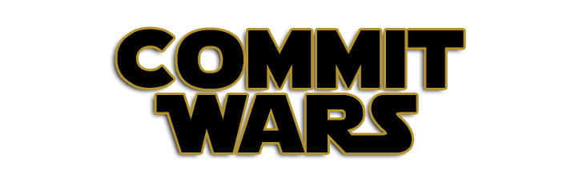

#Commit Wars
Minhas aventuras pelo mundo Open Source na jornada *[Write Code Every Day](http://ejohn.org/blog/write-code-every-day/)*.

> Inspirado por [Raphael Amorim](https://github.com/raphamorim) e [sua história](https://github.com/raphamorim/500-dias-de-open-source).

##Minha Gamificação :)

Para tornar meus dias mais divertidos e me manter motivado, eu fui criando diversas conquistas mentalmente, e ainda continio criando metas novas a cada dia, este repositório tem o objetivo de organizar isso, e quem sabe motivar alguem a se divertir junto comigo nessa jornada tão cheia de reconpensas reias que a vida de contribuiddor.

###Resultados Parciais
**1º Mês** - **77** Commits / **19** Pull Requests / **4** Issues

###Conquistas
**Projetos pessoais**
- [x] Criar 1 projeto relevante
- [x] 1 Star em um projeto
- [ ] Criar 5 projetos relevantes
- [x] 10 Stars em um unico projeto
- [x] 25 Stars em um unico projeto
- [ ] 50 Stars em um unico projeto
- [ ] 75 Stars em um unico projeto
- [ ] 100 Stars em um unico projeto
- [ ] 5 projetos com mais de 10 Stars

**Contribuições**
- [x] 1 Pull Request aceito
- [x] Contribuir para 5 projetos relevantes
- [ ] Contribuir para um projeto grande (+ 1.000 Stars)

**Amigos**
- [ ] Criar um projeto em conjunto com amigos
- [ ] Criar uma organização
- [ ] Ser chamado para participar de uma organização

**Conquistas especiais**
- [ ] 1 commit por hora durante 24 horas consecutivas.
- [ ] 1 Pull Request por dia durante 10 dias em projetos diferentes.

**Outros**
- [x] Ter um projeto divulgado em alguma Weekly
- [x] 10 Followers
- [ ] 25 Followers
- [ ] 50 Followers
- [ ] 75 Followers
- [ ] 100 Followers
- [ ] Atingir 1.000 contribuições

##Registro da aventura
- [Epsode I - A Ameaça Fantasma | Maio - 2015](https://medium.com/@afonsopacifer/commit-wars-5c51ddd837cd)

##Dicas
- Os commits devem ser feitos nas primeiras horas do dia, por exemplo as 00:30h.

##Referências
- [Raphael Amorim - Como ser um desenvolvedor transante - Parte I](https://medium.com/@raphamorim/como-ser-um-desenvolvedor-transante-parte-i-e010c125847f)
- [Raphael Amorim - Writting code every single day in a Half Year](https://medium.com/@raphamorim/what-ive-learned-writting-code-every-single-day-in-a-half-year-a6c504e7300f)
- [John Resig - Write Code Every Day](http://ejohn.org/blog/write-code-every-day/)
- [Mark Zuckerbergs - Code every day](http://www.zdnet.com/article/mark-zuckerbergs-personal-challenge-for-2012-code-every-day/)

##Licença
[MIT Licence](licence.md) © Afonso Pacifer
